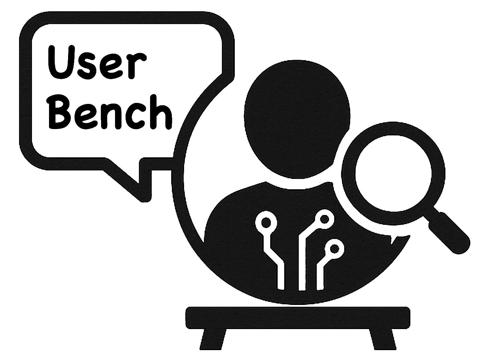
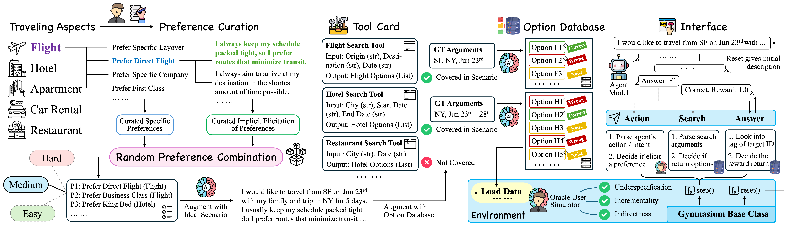

# UserBench: An Interactive Gym Environment for User-Centric Agents

This is the official repository for paper "UserBench: An Interactive Gym Environment for User-Centric Agents".

UserBench is an evaluation environment for testing language models on multi-turn travel planning tasks. This open-source implementation provides a robust framework for evaluating how well language models can understand user preferences, make appropriate function calls, and provide personalized recommendations in travel planning scenarios.



## 🚀 Quick Start

### Installation

```bash
# Clone the repository
git clone https://github.com/SalesforceAIResearch/UserBench.git
cd UserBench

# Install dependencies
pip install -r requirements.txt

# Set up your API keys (choose one or more)
export OPENAI_API_KEY="your-openai-key-here"
```

### Basic Evaluation with eval.py

The `eval.py` script is the main evaluation tool for TravelGym. It supports various model types:

#### 1. Evaluating OpenAI Models

```bash
python eval.py \
    --model_name gpt-4o \
    --port 8000 \
    --max_turns 20 \
    --pass_k 1 \
    --temperature 0.0 \
    --envs travel22 travel33 travel44 \
    --save_name travel_gpt4o_eval
```

#### 2. Evaluating Local Models with vLLM

First, start your vLLM server:
```bash
# Start vLLM server (example)
# Example:
vllm serve Qwen/Qwen3-8B \
   --max-model-len 32768 \
   --gpu-memory-utilization 0.9 \
   --tensor-parallel-size 4 \
   --enable-auto-tool-choice \
   --tool-call-parser hermes \
   --chat-template tool_template/hermes.jinja \
   --port 8000
```

Please make sure that tool call is enabled when serving the model.

Then evaluate:
```bash
python eval.py \
    --model_name Qwen/Qwen3-8B \
    --port 8000 \
    --max_turns 20 \
    --pass_k 1 \
    --temperature 0.0 \
    --envs travel22 travel33 travel44 \
    --save_name travel_llama2_eval
```

#### 3. Evaluating Other API Models

```bash
# Together AI API
python eval.py \
    --model_name deepseek-chat \
    --port 8000 \
    --max_turns 20 \
    --temperature 0.0 \
    --envs travel22 travel33 travel44 \
    --save_name travel_deepseek_eval

# Google Gemini
python eval.py \
    --model_name gemini-2.5-pro \
    --port 8000 \
    --max_turns 20 \
    --temperature 0.0 \
    --envs travel22 travel33 travel44 \
    --save_name travel_gemini_eval
```

Please note that the envs being evaluated could also be customized. Please refer to `travelgym/data` directory for more details.

### Configuration Options

| Parameter | Description | Default |
|-----------|-------------|---------|
| `--model_name` | Model name or path | Required |
| `--port` | Port for vLLM server (local models) | 8000 |
| `--max_turns` | Maximum conversation turns | 20 |
| `--pass_k` | Number of attempts per task | 1 |
| `--temperature` | Model temperature | 0.0 |
| `--envs` | Evaluation environments | travel22 travel33 travel44 |
| `--save_name` | Result file prefix | model_name |

## 🏗️ Architecture

TravelGym is built on the Gymnasium framework with the following key components:

### Core Environment (`travelgym/env/`)
- **`travel_env.py`**: Main environment with conversation and evaluation logic
- **`prompts.py` / `prompt_async.py`**: LLM prompts and response generation
- **`task_data.py`**: Dataset loading and management
- **`utils.py`**: Utility functions for evaluation

### Configuration (`travelgym/config.py`)
- Centralized configuration management
- Model-specific settings
- Environment parameters

### Evaluation Data (`travelgym/data/`)
- Structured scenarios with user preferences
- Ground truth annotations
- Multiple difficulty levels (travel22, travel33, travel44)

## 🔧 Advanced Usage

### Custom Evaluation Scripts

You can customize evaluation by modifying `eval.py` or creating your own scripts:

```python
import travelgym

# Create custom configuration
config = travelgym.TravelGymConfig(
    max_steps=15,
    temperature=0.2,
    data_mode="single",
    verbose=True
)

# Initialize environment
env = travelgym.TravelEnv(config)

# Run evaluation loop
observation, info = env.reset()
for step in range(config.max_steps):
    # Your model logic here
    action = your_model.generate(observation['feedback'])
    observation, reward, terminated, truncated, info = env.step(action)
    if terminated or truncated:
        break
```
